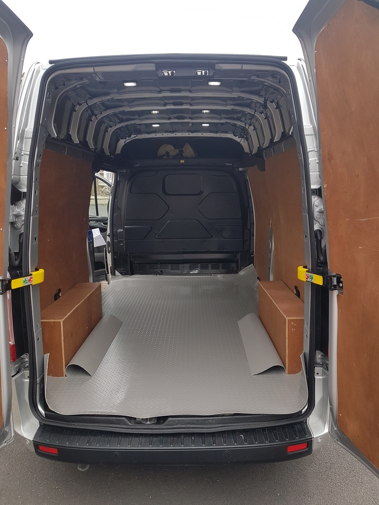
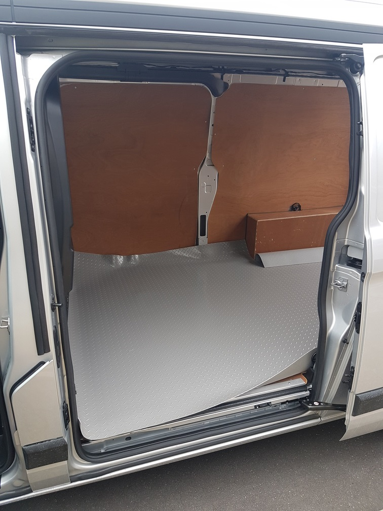
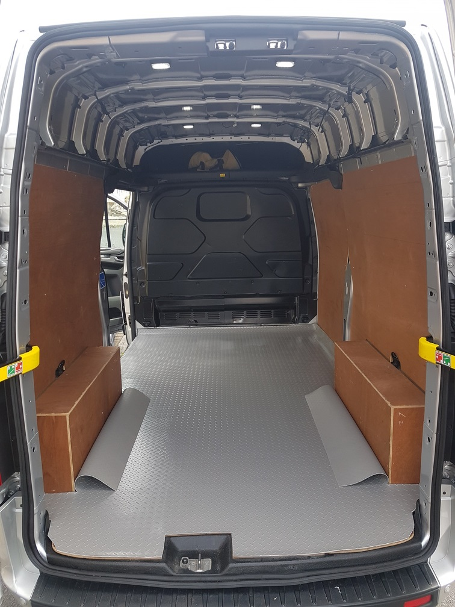
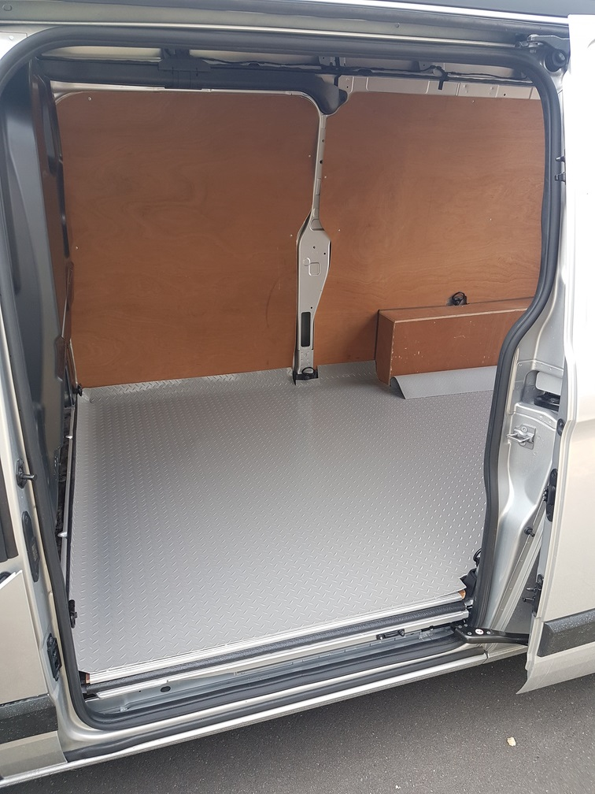

# K888 Windsurfing Van

## Flooring

### Materials

[Diamond Tread Safety Flooring Width 2.2 metres And Thickness 3mm Gray](https://www.slip-not.co.uk/products/diamond-tread-safety-flooring-linear-metre?variant=40340554547393) - bought from [Slip-NOT.co.uk](https://www.slip-not.co.uk/)

This cost £68.16 per metre (including VAT) and I bought 3m for the floor of the van.

### Fitting

I started by cutting the flooring to approximately the right size before putting it into the van.

Once in the van, I trimmed the edges and corners. You'll note that the edges (intentionally) curve up the sides of the van.

### Lessons Learnt

- The pattern is not exactly parallel / perpendicular to the roll. This causes confusion when measuring and cutting!

